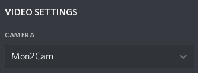

# Mon2Cam

Fix for multi-monitor Discord screensharing

## Dependencies:

- [Deno]
- [xrandr](X11)
- [ffmpeg](X11) or [wf-recorder](wlroots)
- [v4l2loopback] 0.12+

Note:
Ubuntu 18.04 and below does not provide v4l2loopback 0.12, if you use older versions of Ubuntu you will need to [compile from source](https://github.com/umlaeute/v4l2loopback#install)

## Instructions:

- Install [Deno]
- Run `curl -s https://raw.githubusercontent.com/ShayBox/Mon2Cam/master/install.sh | sh`
- Open a new terminal and type `mon2cam`
- Switch discord webcam

You can also use the [AUR] package which is a deno bundle and a desktop file

```
Mon2Cam - Monitor 2 Camera

Mon2Cam [options] [value]

options:
-h,  --help,       Show help
-f,  --framerate,  Set framerate
-d,  --device,     Set device number
-m,  --monitor,    Set monitor number
-r,  --resolution, Set output resolution (W:H)
-vf, --vflip,      Vertically flip the camera
-hf, --hflip,      Horizontally flip the camera
-b,  --border,     Add border when scaling to avoid stretching
-s,  --sound,      Create virtual sink and route sound into it
-v,  --verbose,    Show verbose output

To find out more, visit https://github.com/shaybox/mon2cam
```

```
0: 1920x1080
1: 1366x768
2: 1366x768
Which monitor?
0
INFO CTRL + C to stop
INFO The screen will look mirrored for you, not others
```



## Audio routing

There is a built in audio streaming feature, but it's quite **experimental**. It uses _pulseaudio_ to route the audio of your microphone (or any other input) and the sound of any selected output(application) into a virtual sink which then you can select as an input in discord.

To use, pass the `-s` option, select the appropriate applications and sources (You have to pass a space separated list of ids, or a single id). Then, set the default recording device to be the VirtualSink Monitor and then instruct discord to record from the monitor of the VirtualSink. After this, you should disable noise cancellation and noise reduction in discord, to achieve a good quality stream.

Also **note** that in the current implementation, if you use this feature, you won't be able to hear the selected application(s), only the people listening to the stream. You can workaround this by using a command like: `ffplay -f pulse -i default -nodisp` and then changing the recorded source in _pavucontrol_, however you will also hear any inputs that you might have passed (so if you passed your microphone, you will hear yourself).


[deno]: https://deno.land/
[xrandr]: https://www.x.org/releases/X11R7.7/doc/man/man1/xrandr.1.xhtml
[ffmpeg]: http://ffmpeg.org/
[v4l2loopback]: https://github.com/umlaeute/v4l2loopback
[aur]: https://aur.archlinux.org/packages/mon2cam-git/
